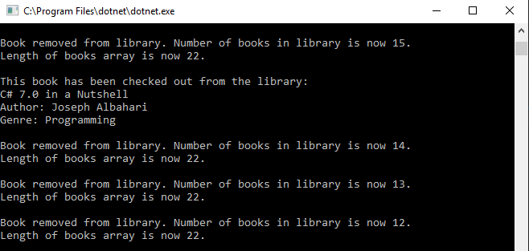
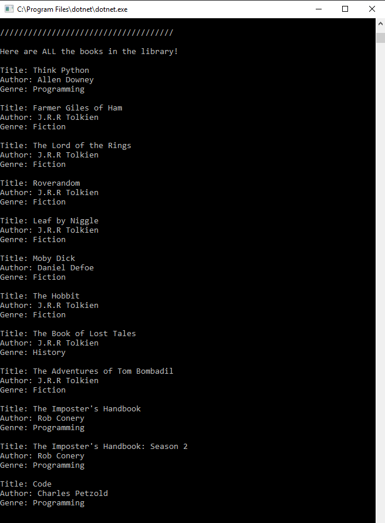
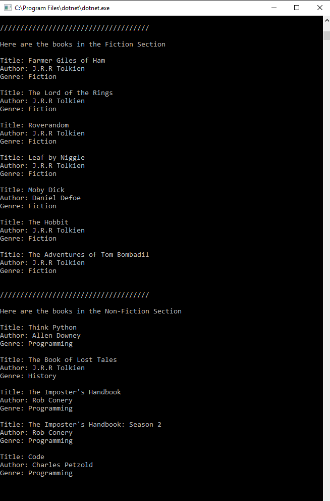

# Code 401 Lab 07: Phil's Lending Library

#### Lab07_LendingLibrary
##### *Author: Andrew Curtis*

## Description

This is a C# console app that uses multiple classes and a generic collection to create a basic lending library with functionality for adding and removing books from the library and viewing all books available in the library as well as in different sections of the library grouped by genre.


## Getting Started

Clone this repository to your local machine.
```
$ git clone https://github.com/amjcurtis/Lab07_LendingLibrary.git
```

#### To run the program from Visual Studio:
Select `File` -> `Open` -> `Project/Solution`

Next navigate to the location where you cloned the repository.

Double-click on the `Lab07_LendingLibrary` directory.

Then select and open `Lab07_LendingLibrary.sln`


## Visuals

##### Add books to library


##### Remove books from library



##### Display all books in library



##### Display books in fiction and non-fiction genres




## Change Log

#### v1.1

`2019-03-28`-`2019-03-31`: Built out library classes, required methods, UI, and unit tests. Added documentation.
